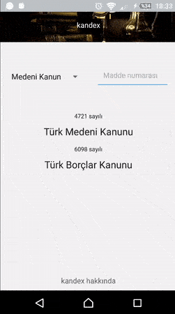

### kandex | DISCONTINUED
Kandex is an android app made with react-native for Turkish laws.

#### Demo

**Including**: [Turkish Civil Code](https://www.mevzuat.gov.tr/MevzuatMetin/1.5.4721.pdf), [Turkish Code of Obligations](https://www.mevzuat.gov.tr/MevzuatMetin/1.5.6098.pdf)
**~~Will be included~~**: TTK, Anayasa, HMK, TCK, CMK

**~~TODOS~~**:
* Son maddeye ulaşıldığında ileri butonu kaldırıla.
* 'Kandex hakkında' modalına içerik yazıla.
* Kanuna konu başlıklarıyla genel bakış için scene yazıla.
* [BUG] Kullanıcının maddeler arasında ilerlediği en yüksek hızda (~.25 saniye) component render edilemediği zamanlarda app dara düşüyor, sıkıntılara giriyor. Kullanıcıya bu kadar sık titreşim gönderemeyeceği hatırlatılmalı yahut her madde geçişinde ileri/geri butonları eser miktarda disable edilebilir. :panda_face: